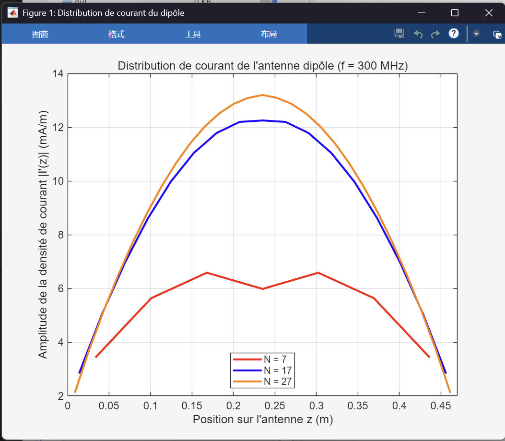
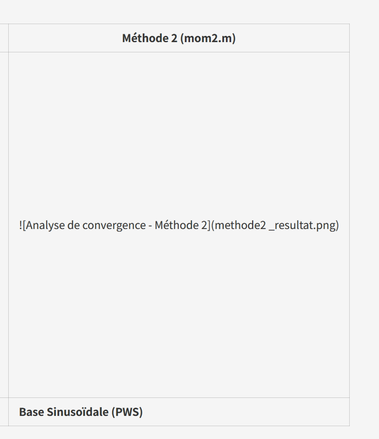

SS好的，非常抱歉刚才的回复出现了编码问题。

我完全理解您的需求了。您需要一个详细的、为10分钟答辩设计的完整PPT讲稿，内容要 **中法双语** （先中文，后法语），并且要 **包含一个目录 (Sommaire)** 。最重要的是，您希望将**理论公式 (Formulation)与您的MATLAB代码 (`mom1_fr.m` 和 `mom2.m`)** 紧密结合起来，一页一页地展示。

这是一个专为您10分钟答辩设计的详细讲稿。我将为您之前提到的NEC比较部分留下一个占位符。

---

# Diapositive 1 : Page de Titre (封面页)

**(中文)**

# 基于矩量法 (MoM) 的偶极子天线建模

### 两种数值实现方法的分析与比较

**您的名字 / 团队成员名字**

课程： 雷达与高级数值方法 (Radar et Méthodes numériques avancées)

日期： 20XX年11月16日

---

**(Français)**

# Modélisation d'Antenne Dipôle par la Méthode des Moments (MoM)

### Analyse et Implémentation de Deux Approches Numériques

**Vos Noms / Noms du Groupe**

Cours : Radar et Méthodes numériques avancées

Date : 16 Novembre 20XX

---

# Diapositive 2 : Sommaire (目录)

**(中文)**

1. **引言与问题**
   * 目标：求解电流 **$I(z)$**
   * 仿真参数
2. **理论公式**
   * **从麦克斯韦到 Pocklington 积分方程 **^1^
   * **矩量法 (MoM) 原理 **^2^
3. **方法 1：脉冲基函数 (`<span class="citation-642">mom1_fr.m</span>`)** ^3^
   * **理论公式 (复杂核函数 **$\partial^2G/\partial z^2$**) **^4^
   * MATLAB 代码实现
4. **方法 2：分段正弦 (`<span class="citation-640">mom2.m</span>`)** ^5^
   * **理论公式 (简化核函数 **$G$**) **^6^
   * MATLAB 代码实现
5. **分析与结果**
   * **MoM 收敛性比较 **^7^
   * 与 NEC 的验证 ( *按要求* )
6. **遇到的困难**
7. **总结**

---

**(Français)**

1. **Introduction & Problématique**
   * Objectif : Trouver le courant **$I(z)$**.
   * Paramètres de simulation.
2. **Formulation Théorique**
   * **De Maxwell à l'Équation Intégrale de Pocklington. **^8^
   * **Principe de la Méthode des Moments (MoM). **^9^
3. **Méthode 1 : Base Impulsionnelle (`<span class="citation-635">mom1_fr.m</span>`)** ^10^
   * **Formulation (Noyau **$\partial^2G/\partial z^2$**). **^11^
   * Implémentation MATLAB.
4. **Méthode 2 : Base Sinusoïdale (`<span class="citation-633">mom2.m</span>`)** ^12^
   * **Formulation (Noyau simplifié **$G$**). **^13^
   * Implémentation MATLAB.
5. **Analyse & Résultats**
   * **Comparaison de la convergence MoM vs MoM. **^14^
   * Comparaison MoM vs NEC ( *partie demandée dans l'énoncé* ).
6. **Difficultés Rencontrées**
7. **Conclusion**

---

# Diapositive 3 : Introduction & Problématique (引言与问题)

**(中文)**

### 项目目标

求解"薄线" (thin-wire) 偶极子天线上的 **未知电流分布 **$I(z)$**** 。

### 为什么重要？

* 电流 **$I(z)$** 是所有辐射的“源”。
* 知道 **$I(z)$**，我们才能计算：
  1. **输入阻抗 (**$Z_{in}$**)** ：天线匹配的关键。
  2. **辐射方向图** ：天线在空间中的辐射特性。

### 仿真参数 (代码 `mom1` & `mom2` 均采用)

* **频率 (**$f$**)：**$300 \text{ MHz}$** **^15^^15^
* **波长 (**$\lambda$**)：**$c/f = 1 \text{ m}$** **^16^^16^
* **天线长度 (**$l$**)：**$0.47 \lambda = 0.47 \text{ m}$** (接近 **$\lambda/2$** 谐振) **^17^^17^
* **导线半径 (**$a$**)：**$0.005 \lambda = 0.005 \text{ m}$** (满足 "薄线" 条件 **$a \ll \lambda$**) **^18^^18^
* **激励电压 (**$V_s$**)：**$1 \text{ V}$** (采用 "delta-gap" 馈电模型) **^19^^19^

---

**(Français)**

### Objectif du Projet

Déterminer la distribution du courant inconnu **$I(z)$** le long d'une antenne dipôle "fil-mince" (thin-wire).

### Pourquoi ?

* Le courant **$I(z)$** est la "source" de tout.
* Si on connaît **$I(z)$**, on peut calculer :
  1. **L'impédance d'entrée (**$Z_{in}$**)** : Cruciale pour l'adaptation.
  2. **Le diagramme de rayonnement** : Comment l'antenne émet dans l'espace.

### Paramètres de Simulation (Communs à `mom1` & `mom2`)

* **Fréquence (**$f$**) :**$300 \text{ MHz}$** **^20^^20^
* **Longueur d'onde (**$\lambda$**) :**$c/f = 1 \text{ m}$** **^21^^21^
* **Longueur dipôle (**$l$**) :**$0.47 \lambda = 0.47 \text{ m}$** (proche de la résonance **$\lambda/2$**) **^22^^22^
* **Rayon du fil (**$a$**) :**$0.005 \lambda = 0.005 \text{ m}$** (condition "fil-mince" **$a \ll \lambda$** respectée) **^23^^23^
* **Tension (**$V_s$**) :**$1 \text{ V}$** (modèle "delta-gap") **^24^^24^

---

# Diapositive 4 : Formulation Théorique (1/2) (理论公式 1/2)

**(中文)**

### 从麦克斯韦到积分方程

从麦克斯韦方程组出发，引入磁矢量势 **$\vec{A}$** 和标量势 **$V$**，我们可以推导出连接电流 **$I_z$** 和激励场 **$E_z^a$** 的关系。

**Pocklington 积分方程 (PDF p.10) **^25^：

$$
\underbrace{ \int_{-l/2}^{l/2} I_z(z') \left( k^2 + \frac{\partial^2}{\partial z^2} \right) G(R) dz' }_{\text{算子 } L(I_z)} = \underbrace{ -j\omega\epsilon E_z^a(z) }_{\text{激励 } g(z)}
$$

* **$I_z(z')$**：我们要求解的**未知电流**。
* [cite\_start]**$G(R)$**：格林函数 ($\frac{e^{-jkR}}{4\pi R}$)，描述波的传播 ^26^。
* [cite\_start]**$R$**：$\sqrt{a^2 + (z-z')^2}$ (源点与场点距离, PDF p.7) ^27^。
* [cite\_start]**$E_z^a(z)$**：已知的**激励电场** (即我们的 $V_s$) ^28^。

**挑战：** 这个方程无法直接通过解析方法（纸笔）求解。

---

**(Français)**

### De Maxwell à l'Équation Intégrale

En partant des équations de Maxwell et en utilisant les potentiels vecteur $\vec{A}$ et scalaire $V$, on arrive à une équation intégrale qui lie le courant $I_z$ au champ excitateur $E_z^a$.

[cite\_start]**Équation de Pocklington (PDF p.10)^29^:**

$$
\underbrace{ \int_{-l/2}^{l/2} I_z(z') \left( k^2 + \frac{\partial^2}{\partial z^2} \right) G(R) dz' }_{\text{Opérateur } L(I_z)} = \underbrace{ -j\omega\epsilon E_z^a(z) }_{\text{Excitation } g(z)}
$$

* **$I_z(z')$** : Le **courant inconnu** que l'on cherche.

  * [cite\_start]**$G(R)$** : La fonction de Green ($\frac{e^{-jkR}}{4\pi R}$), décrit la propagation^30^.
  * [cite\_start]**$R$** : $\sqrt{a^2 + (z-z')^2}$ (distance source-observation, PDF p.7)^31^.
  * [cite\_start]**$E_z^a(z)$** : Le **champ excitateur connu** (notre $V_s$)^32^.

**Défi :** Impossible à résoudre analytiquement.

---

# Diapositive 5 : Formulation Théorique (2/2) (理论公式 2/2)

**(中文)**

### 矩量法 (MoM) 原理

MoM 将连续的积分方程 $L(f) = g$ 转化为离散的线性方程组 $[Z][I] = [V]$。

**关键步骤 (PDF p.11-12)：**

1. **离散化 (Discrétisation)：** 将天线"切割"成 $N$ 段。
2. [cite\_start]**近似 (Approximation) (基函数)：** 将未知电流 $I_z$ 表示为 $N$ 个**基函数 $f_n$** 的线性叠加 [cite: 161, 162]。
   * $I_z(z) \approx \sum_{n=1}^{N} I_n f_n(z)$
3. [cite\_start]**测试 (Test) (获取 N 个方程)：** 这是从"1个方程，N个未知数" [cite: 164] 变为"N个方程，N个未知数"的关键。有两种主要途径 (PDF p.12)：
   * [cite\_start]**方法 A：点匹配法 (Point-Matching)** [cite: 167, 168]
     * 选择 $N$ 个离散点 $z_m$ (通常是每段的中心)。
     * 强迫方程 **只在 这 $N$ 个点上** 精确成立。
     * *(这是 `mom1_fr.m` 采用的方法)*
   * [cite\_start]**方法 B：投影法 (Projection / Pondérée)** [cite: 172, 174]
     * 选择 $N$ 个 **测试函数 $g_m$** (例如脉冲函数)。
     * 强迫方程在与 $g_m$ 做**加权积分 (内积)** 的意义下成立。
     * *(这是 `mom2.m` 采用的方法)*
4. [cite\_start]**求解 (Résolution)：** 求解 $N \times N$ 矩阵方程 $[I] = [Z]^{-1}[V]$ [cite: 177]。

---

**(Français)**

### Principe de la Méthode des Moments (MoM)

La MoM transforme l'équation intégrale **continue** $L(f) = g$ en un système d'équations linéaires **discret** $[Z][I] = [V]$.

**Les Étapes Clés (PDF p.11-12) :**

1. **Discrétisation :** On "découpe" l'antenne en $N$ segments.
2. [cite\_start]**Approximation (Fonctions de Base) :** On exprime le courant inconnu $I_z$ comme une somme de $N$ **fonctions de base $f_n$**[cite: 161, 162].
   * $I_z(z) \approx \sum_{n=1}^{N} I_n f_n(z)$
3. [cite\_start]**Test (Obtenir N équations) :** L'étape clé pour passer de "1 équation, N inconnues" [cite: 164] à "N équations, N inconnues". Il y a deux approches (PDF p.12) :
   * [cite\_start]**Méthode A : Point-Matching (Collocation)** [cite: 167, 168]
     * On choisit $N$ points discrets $z_m$ (souvent le centre du segment).
     * On force l'équation à être vraie **uniquement en ces $N$ points**.
     * *(C'est l'approche de `mom1_fr.m`)*
   * [cite\_start]**Méthode B : Projection (Méthode Pondérée)** [cite: 172, 174]
     * On choisit $N$ **fonctions test $g_m$** (ex: une fonction "pulse").
     * On force l'équation à être vraie au sens d'une **intégrale pondérée (produit scalaire)**.
     * *(C'est l'approche de `mom2.m`)*
4. [cite\_start]**Résolution :** On résout le système matriciel $N \times N$ $[I] = [Z]^{-1}[V]$[cite: 177].

---

# Diapositive 6 : Méthode 1 - Formulation (Base Impulsionnelle) (方法1：理论)

**(中文)**

* [cite\_start]**实现代码：** `mom1_fr.m` ^35^
* **选择 (最简单的)：**
  * [cite\_start]**基函数 ($f_n$)：** **脉冲函数 (Pulse)**。假设 $I(z) = I_n$ (常数) 在第 $n$ 段上 ^36^。
  * [cite\_start]**测试函数 ($g_m$)：** **点匹配 (Point-Matching)**。强迫方程在每段 $m$ 的中心点 $z_m$ 处精确成立 ^37^。
* [cite\_start]**理论公式 (PDF p.14-15) ^38^：**
  * $Z_{mn}$ 元素 (第 $n$ 段对 $m$ 点的贡献) 是：

$$
Z_{mn} \propto \int_{\text{segment n}} \left( k^2 G(R) + \color{red}{\frac{\partial^2 G(R)}{\partial z^2}} \right) dz'
$$

* **困难点：**$\color{red}{\frac{\partial^2 G(R)}{\partial z^2}}$** 这一项** **在数学上极其复杂** **。其解析表达式 (PDF p.14) **^39^ 为：

$$
\frac{\partial^{2}G}{\partial z^{2}} = \frac{e^{-jkR}}{4\pi R^{5}}\left[-R^{2}(1+jkR)-(z-z')^{2}\right]
$$

* *我们的代码必须实现这个复杂的公式。*

---

**(Français)**

* **Implémentation :**`<span class="citation-605">mom1_fr.m</span>` ^40^
* **Choix (le plus simple) :**

  * **Fonctions de Base (**$f_n$**) :**  **Impulsionnelles (Pulse)** . **On suppose **$I(z) = I_n$** (constante) sur chaque segment **$n$^41^.
  * **Fonctions Test (**$g_m$**) :**  **Point-Matching** . **On force l'équation à être vraie en un seul point **$z_m$** au centre de chaque segment **$m$^42^.
* **Formulation (PDF p.14-15)**^43^:

  * L'élément **$Z_{mn}$** (interaction entre le segment **$n$** et le point **$m$**) est :

$$
Z_{mn} \propto \int_{\text{segment n}} \left( k^2 G(R) + \color{red}{\frac{\partial^2 G(R)}{\partial z^2}} \right) dz'
$$

* **La Difficulté :** Le terme **$\color{red}{\frac{\partial^2 G(R)}{\partial z^2}}$** est  **analytiquement très compliqué** . **La formule (PDF p.14) **^44^ est :

$$
\frac{\partial^{2}G}{\partial z^{2}} = \frac{e^{-jkR}}{4\pi R^{5}}\left[-R^{2}(1+jkR)-(z-z')^{2}\right]
$$

* *C'est cette formule exacte que nous devons implémenter dans le code.*

---

# Diapositive 7 : Méthode 1 - Code MATLAB (`mom1_fr.m`) (方法1：代码)

**(中文)**

* **我们的代码 **`<span class="citation-600">mom1_fr.m</span>` ^45^ 是对这个复杂公式的直接“翻译”。

**1. Z 矩阵循环 (**$N \times N$**)：**

* 我们使用 MATLAB 的 `integral` 函数来计算上一页的积分。
* 被积函数 (`@(zp)`) 调用了我们的核心函数 `derivee`。

**Matlab**

```
% Fichier: mom1_fr.m (lignes 64-77)
for m = 1:N  % m = 观测点 (测试)
    zm = zc(m);
    for n = 1:N  % n = 源线段 (基)
        zn0 = z_bords(n); zn1 = z_bords(n+1);

        % 被积函数就是那个复杂公式
        integrande = @(zp) derivee(zp, zm, a, k);
  
        valeur_integrale = integral(integrande, zn0, zn1);
        Z(m,n) = (1j / (omega * eps0)) * valeur_integrale;
    end
end
```

**2. 核心函数 `derivee` (计算的核心)：**

* **这个函数 (行 138-166) **^46^ 实现了 **$\left( k^2 G + \frac{\partial^2 G}{\partial z^2} \right)$**。

**Matlab**

```
% Fichier: mom1_fr.m (lignes 138-166)
function val = derivee(zp, zm, a, k)
    h = zm - zp;
    R = sqrt(a.^2 + h.^2);
    G = exp(-1j*k*R) ./ (4*pi*R);
  
    % ... (此处是 p.14 页公式的复杂解析计算
    %       'curly_braces_content') ...
  
    d2G_dz2 = (exp(-1j*k*R) ./ (4*pi*R.^5)) .* curly_braces_content;
  
    val = k^2 * G + d2G_dz2; % <- 返回 k²G + d²G/dz²
end
```

---

**(Français)**

* **Notre code **`<span class="citation-597">mom1_fr.m</span>` ^47^ est une traduction directe de cette formulation complexe.

**1. Boucle de la Matrice Z (**$N \times N$**) :**

* On utilise `integral` de MATLAB pour calculer l'intégrale de la diapo 6.
* L'intégrande (`@(zp)`) appelle notre fonction noyau `derivee`.

**Matlab**

```
% Fichier: mom1_fr.m (lignes 64-77)
for m = 1:N  % m = point d'observation (test)
    zm = zc(m);
    for n = 1:N  % n = segment source (base)
        zn0 = z_bords(n); zn1 = z_bords(n+1);

        % L'intégrande EST la formule compliquée
        integrande = @(zp) derivee(zp, zm, a, k);
  
        valeur_integrale = integral(integrande, zn0, zn1);
        Z(m,n) = (1j / (omega * eps0)) * valeur_integrale;
    end
end
```

**2. Le Noyau `derivee` (le "cœur" du calcul) :**

* **Cette fonction (lignes 138-166) **^48^ implémente **$\left( k^2 G + \frac{\partial^2 G}{\partial z^2} \right)$**.

**Matlab**

```
% Fichier: mom1_fr.m (lignes 138-166)
function val = derivee(zp, zm, a, k)
    h = zm - zp;
    R = sqrt(a.^2 + h.^2);
    G = exp(-1j*k*R) ./ (4*pi*R);
  
    % ... (long calcul analytique de 'curly_braces_content' 
    %      correspondant à la formule p.14)...
  
    d2G_dz2 = (exp(-1j*k*R) ./ (4*pi*R.^5)) .* curly_braces_content;
  
    val = k^2 * G + d2G_dz2; % <- On retourne k²G + d²G/dz²
end
```

---

# Diapositive 8 : Méthode 2 - Formulation (Base Sinusoïdale) (方法2：理论)

**(中文)**

* [cite\_start]**实现代码：** `mom2.m` ^49^

---

### **方法2：分段正弦基函数 + 脉冲测试函数投影**

#### **1. 基函数的选择：分段正弦 (PWS - Piecewise Sinusoidal) [PDF p.17]^50^**

* **为什么选择正弦？** 在波动问题中，正弦函数更接近物理真实的解形式。对于偶极子天线，电流分布应该呈现波动特性。
* **PWS 基函数定义：** 基函数 $f_n$ **跨越两个段**（从节点 $z_{n-1}$ 到 $z_{n+1}$，共三个节点）：
  * $f_n(z') = \frac{\sin[k(z' - z_{n-1})]}{\sin(k\Delta)}$，当 $z_{n-1} \leq z' \leq z_n$ 时
  * $f_n(z') = \frac{\sin[k(z_{n+1} - z')]}{\sin(k\Delta)}$，当 $z_n \leq z' \leq z_{n+1}$ 时
  * $f_n(z') = 0$，在其他地方
* **特点：**
  * 在节点 $z_{n-1}$ 处：$f_n(z_{n-1}) = \frac{\sin(0)}{\sin(k\Delta)} = 0$
  * 在节点 $z_n$ 处：$f_n(z_n) = \frac{\sin[k(z_n - z_{n-1})]}{\sin(k\Delta)} = \frac{\sin(k\Delta)}{\sin(k\Delta)} = 1$（**峰值/中心节点**）
  * 在节点 $z_{n+1}$ 处：$f_n(z_{n+1}) = \frac{\sin(0)}{\sin(k\Delta)} = 0$
  * **关键：** 每个基函数 $f_n$ **跨越三个节点**（$z_{n-1}$, $z_n$, $z_{n+1}$），这确保了：
    * 电流在节点处**自动连续**（因为相邻基函数在共同节点处取值相同）
    * 两端满足 $I=0$ 的边界条件（$f_1$ 在 $z_0$ 处为0，$f_{N-1}$ 在 $z_N$ 处为0）

#### **2. 测试函数的选择：脉冲函数 (Pulse) [方法B：投影法]^51^**

* **选择：** 脉冲测试函数 $g_m(z)$ 在第 $m$ 段上为常数（等于1），在其他地方为0。
* **操作：** 我们用 $g_m$ **乘以**原方程，然后在第 $m$ 段上**积分**（投影/加权积分）。

#### **3. 关键技巧：分部积分法 [PDF p.16]^52^**

**原始 Pocklington 方程：**

$$
\int_{-l/2}^{l/2} I_z(z') \left( k^2 + \frac{\partial^2}{\partial z^2} \right) G(R) dz' = -j\omega\epsilon E_z^a(z)
$$

**问题：** $\frac{\partial^2 G}{\partial z^2}$ 的计算**极其复杂**（如方法1所示）！

**解决方案：** 通过**分部积分法**，我们将导数从 $G$（复杂）**转移**到 $I_z$（简单）上：

$$
\int I_z \cdot \frac{\partial^2 G}{\partial z^2} dz' \xrightarrow{\text{分部积分}} \int \frac{\partial^2 I_z}{\partial z'^2} \cdot G dz'
$$

**变换后的方程：**

$$
\int_{-l/2}^{l/2} \left( \frac{\partial^2 I_z}{\partial z'^2} + k^2 I_z \right) \cdot G(R) dz' = -j\omega\epsilon E_z^a(z)
$$

#### **4. 精妙之处：PWS 的特殊性质 [PDF p.18]^53^**

对于 PWS 基函数 $f_n$，算子 $(\frac{\partial^2}{\partial z'^2} + k^2)$ 的作用**神奇地简化为三个 Delta 函数**：

$$
\left( \frac{\partial^2 f_n}{\partial z'^2} + k^2 f_n \right) = \frac{k}{\sin(k\Delta)} \left[ \delta(z' - z_{n+1}) + \delta(z' - z_n) - 2\cos(k\Delta) \delta(z' - z_{n+1/2}) \right]
$$

**为什么？** 因为 PWS 函数满足**Helmholtz 方程** $(\frac{\partial^2}{\partial z'^2} + k^2) f_n = 0$ 在大部分区域，只在节点处产生跳跃！

**注意：** 正如第1节所述，每个PWS基函数$f_n$本身就**跨越三个节点**（$z_{n-1}$, $z_n$, $z_{n+1}$），这就是为什么最终公式中自然出现这三个节点。

#### **5. 最终简化公式 [PDF p.18]**

当我们将这个 Delta 函数表达式代入积分时，积分**立即简化为**三个点的评估：

$$
Z_{mn} = \frac{jk}{\omega\epsilon_0 \sin(k\Delta)} \int_{\text{seg test m}} \left[ G(R_{n+1}) + G(R_{n-1}) - 2\cos(k\Delta) G(R_n) \right] dz
$$

其中 $R_j = \sqrt{a^2 + (z - z_j)^2}$。

**公式中三个节点的含义：**

* **$z_{n+1}$**：基函数$f_n$的**右端点**（定义域的右边界），对应$R_{n+1}$
* **$z_n$**：基函数$f_n$的**中心节点**（定义域的中点，左右两段的交界），对应$R_n$
* **$z_{n-1}$**：基函数$f_n$的**左端点**（定义域的左边界），对应$R_{n-1}$

**这正反映了第1节中PWS基函数的定义：** 每个基函数$f_n$本身就跨越从$z_{n-1}$到$z_{n+1}$的区间（三个节点），因此其导数运算自然会涉及这三个节点。

**在代码中的对应：** `zn_centre = z_nodes(n+1)` (对应$z_{n+1}$, 中心节点), `zn_moins_1 = z_nodes(n)` (对应$z_n$, 左端点), `zn_plus_1 = z_nodes(n+2)` (对应$z_{n+2}$, 下一个基函数的右端点)

**优势：**

* ✅ **不再需要计算** $\frac{\partial^2 G}{\partial z^2}$（这曾是最复杂的部分）！
* ✅ 只需计算**简单的格林函数** $G(R) = \frac{e^{-jkR}}{4\pi R}$
* ✅ 数值稳定性**更好**，收敛**更快**

---

**(Français)**

* **Implémentation :**`<span class="citation-589">mom2.m</span>` ^54^

---

### **Méthode 2 : Base Sinusoïdale + Projection avec Fonctions Test Impulsionnelles**

#### **1. Choix des Fonctions de Base : Sinusoïdales par Morceaux (PWS) [PDF p.17]^55^**

* **Pourquoi sinusoïdale ?** Dans les problèmes d'onde, les sinusoïdes sont plus proches de la réalité physique. Pour un dipôle, la distribution de courant devrait présenter des caractéristiques ondulatoires.
* **Définition de la base PWS :** La fonction de base $f_n$ **s'étend sur deux segments** (du nœud $z_{n-1}$ au nœud $z_{n+1}$, soit trois nœuds) :
  * $f_n(z') = \frac{\sin[k(z' - z_{n-1})]}{\sin(k\Delta)}$, si $z_{n-1} \leq z' \leq z_n$
  * $f_n(z') = \frac{\sin[k(z_{n+1} - z')]}{\sin(k\Delta)}$, si $z_n \leq z' \leq z_{n+1}$
  * $f_n(z') = 0$, ailleurs
* **Caractéristiques :**
  * Au nœud $z_{n-1}$ : $f_n(z_{n-1}) = \frac{\sin(0)}{\sin(k\Delta)} = 0$
  * Au nœud $z_n$ : $f_n(z_n) = \frac{\sin[k(z_n - z_{n-1})]}{\sin(k\Delta)} = \frac{\sin(k\Delta)}{\sin(k\Delta)} = 1$ (**pic/nœud central**)
  * Au nœud $z_{n+1}$ : $f_n(z_{n+1}) = \frac{\sin(0)}{\sin(k\Delta)} = 0$
  * **Clé :** Chaque fonction de base $f_n$ **s'étend sur trois nœuds** ($z_{n-1}$, $z_n$, $z_{n+1}$), ce qui assure :
    * La **continuité automatique** du courant aux nœuds (car les fonctions de base adjacentes prennent la même valeur aux nœuds communs)
    * Les conditions limites $I=0$ aux extrémités ($f_1$ vaut 0 en $z_0$, $f_{N-1}$ vaut 0 en $z_N$)

#### **2. Choix des Fonctions Test : Impulsionnelles (Pulse) [Méthode B : Projection]^56^**

* **Choix :** La fonction test impulsionnelle $g_m(z)$ est constante (égale à 1) sur le segment $m$, nulle ailleurs.
* **Opération :** On **multiplie** l'équation par $g_m$ et on **intègre** sur le segment $m$ (projection/intégrale pondérée).

#### **3. L'Astuce Clé : Intégration par Parties [PDF p.16]^57^**

**Équation de Pocklington originale :**

$$
\int_{-l/2}^{l/2} I_z(z') \left( k^2 + \frac{\partial^2}{\partial z^2} \right) G(R) dz' = -j\omega\epsilon E_z^a(z)
$$

**Problème :** Le calcul de $\frac{\partial^2 G}{\partial z^2}$ est **extrêmement complexe** (comme montré dans la Méthode 1) !

**Solution :** Par **intégration par parties**, on transfère la dérivée de $G$ (compliqué) vers $I_z$ (simple) :

$$
\int I_z \cdot \frac{\partial^2 G}{\partial z^2} dz' \xrightarrow{\text{int. par parties}} \int \frac{\partial^2 I_z}{\partial z'^2} \cdot G dz'
$$

**Équation transformée :**

$$
\int_{-l/2}^{l/2} \left( \frac{\partial^2 I_z}{\partial z'^2} + k^2 I_z \right) \cdot G(R) dz' = -j\omega\epsilon E_z^a(z)
$$

#### **4. La Magie : Propriété Spéciale de PWS [PDF p.18]^58^**

Pour la base PWS $f_n$, l'action de l'opérateur $(\frac{\partial^2}{\partial z'^2} + k^2)$ se **simplifie magiquement en trois fonctions Delta** :

$$
\left( \frac{\partial^2 f_n}{\partial z'^2} + k^2 f_n \right) = \frac{k}{\sin(k\Delta)} \left[ \delta(z' - z_{n+1}) + \delta(z' - z_n) - 2\cos(k\Delta) \delta(z' - z_{n+1/2}) \right]
$$

**Pourquoi ?** Parce que $f_n$ satisfait l'**équation de Helmholtz** $(\frac{\partial^2}{\partial z'^2} + k^2) f_n = 0$ dans la plupart des régions, produisant des sauts uniquement aux nœuds !

**Note :** Comme expliqué à la section 1, chaque fonction de base PWS $f_n$ **s'étend naturellement sur trois nœuds** ($z_{n-1}$, $z_n$, $z_{n+1}$), c'est pourquoi la formule finale implique naturellement ces trois nœuds.

#### **5. Formule Finale Simplifiée [PDF p.18]**

Quand on substitue cette expression de Delta dans l'intégrale, l'intégrale se **simplifie immédiatement** en l'évaluation en trois points :

$$
Z_{mn} = \frac{jk}{\omega\epsilon_0 \sin(k\Delta)} \int_{\text{seg test m}} \left[ G(R_{n+1}) + G(R_{n-1}) - 2\cos(k\Delta) G(R_n) \right] dz
$$

où $R_j = \sqrt{a^2 + (z - z_j)^2}$.

**Signification des trois nœuds dans la formule :**

* **$z_{n+1}$** : **Point terminal droit** de la fonction de base $f_n$ (limite droite du domaine), correspondant à $R_{n+1}$
* **$z_n$** : **Nœud central** de la fonction de base $f_n$ (milieu du domaine, jonction entre les deux segments), correspondant à $R_n$
* **$z_{n-1}$** : **Point terminal gauche** de la fonction de base $f_n$ (limite gauche du domaine), correspondant à $R_{n-1}$

**Cela reflète la définition de la base PWS à la section 1 :** Chaque fonction de base $f_n$ s'étend naturellement de $z_{n-1}$ à $z_{n+1}$ (trois nœuds), donc son opérateur dérivé implique naturellement ces trois nœuds.

**Correspondance dans le code :** `zn_centre = z_nodes(n+1)` (correspond à $z_{n+1}$, nœud central), `zn_moins_1 = z_nodes(n)` (correspond à $z_n$, point terminal gauche), `zn_plus_1 = z_nodes(n+2)` (correspond à $z_{n+2}$, point terminal droit de la prochaine fonction de base)

**Avantages :**

* ✅ **Plus besoin de calculer** $\frac{\partial^2 G}{\partial z^2}$ (c'était la partie la plus complexe) !
* ✅ On calcule uniquement la **fonction de Green simple** $G(R) = \frac{e^{-jkR}}{4\pi R}$
* ✅ Stabilité numérique **meilleure**, convergence **plus rapide**

---

# Diapositive 9 : Méthode 2 - Code MATLAB (`mom2.m`) (方法2：代码)

**(中文)**

* **我们的代码 **`<span class="citation-584">mom2.m</span>` ^59^实现了这个大大简化的公式 (p.18) ^60^。

**1. Z 矩阵循环 (**$(N-1) \times (N-1)$**)：**

* 被积函数 (`@(z)`) 现在只是对 `Green` 函数的三次简单调用。
* 注意：矩阵是 `(N-1)x(N-1)`，因为 PWS 基函数已经隐含了天线两端 **$I=0$** 的边界条件。

**Matlab**

```
% Fichier: mom2.m (lignes 49-68)
Green = @(R) exp(-1j * k * R) ./ (4 * pi * R);

for m = 1:(N-1)
    zm_centre = z_nodes(m+1);
    z_debut = zm_centre - delta/2; z_fin = zm_centre + delta/2;
  
    for n = 1:(N-1)
        zn_centre = z_nodes(n+1);
        zn_moins_1 = z_nodes(n);
        zn_plus_1 = z_nodes(n+2);
  
        % p.18  简化公式的直接翻译
        integrande = @(z) Green(sqrt(a^2 + (z - zn_plus_1).^2)) + ...
                          Green(sqrt(a^2 + (z - zn_moins_1).^2)) - ...
                          2 * cos(k*delta) * Green(sqrt(a^2 + (z - zn_centre).^2));
  
        valeur_integrale = integral(integrande, z_debut, z_fin);
        Z(m, n) = valeur_integrale;
    end
end
% p.18  的常数因子在最后统一应用
Z_final = ((1j * k) / (omega * eps0 * sin(k*delta))) * Z;
```

---

**(Français)**

* **Notre code **`<span class="citation-580">mom2.m</span>` ^61^implémente cette formulation simplifiée (p.18)^62^.

**1. Boucle de la Matrice Z (**$(N-1) \times (N-1)$**) :**

* L'intégrande (`@(z)`) est maintenant une simple combinaison de 3 appels à la fonction `Green`.
* Note : La matrice est `(N-1)x(N-1)` car **$I=0$** aux bords est déjà inclus dans la base PWS.

**Matlab**

```
% Fichier: mom2.m (lignes 49-68)
Green = @(R) exp(-1j * k * R) ./ (4 * pi * R);

for m = 1:(N-1)
    zm_centre = z_nodes(m+1);
    z_debut = zm_centre - delta/2; z_fin = zm_centre + delta/2;
  
    for n = 1:(N-1)
        zn_centre = z_nodes(n+1);
        zn_moins_1 = z_nodes(n);
        zn_plus_1 = z_nodes(n+2);
  
        % Traduction directe de la formule simplifiée (p.18) 
        integrande = @(z) Green(sqrt(a^2 + (z - zn_plus_1).^2)) + ...
                          Green(sqrt(a^2 + (z - zn_moins_1).^2)) - ...
                          2 * cos(k*delta) * Green(sqrt(a^2 + (z - zn_centre).^2));
  
        valeur_integrale = integral(integrande, z_debut, z_fin);
        Z(m, n) = valeur_integrale;
    end
end
% Le facteur constant (p.18)  est appliqué une seule fois à la fin
Z_final = ((1j * k) / (omega * eps0 * sin(k*delta))) * Z;
```

---

# Diapositive 10 : Analyse des Résultats (1/2) : Convergence MoM (结果分析 1/2)

**(中文)**

* 我们比较两种实现的收敛性。

| **方法 1 (mom1_fr.m)**                         | **方法 2 (mom2.m)**                                     |
| ---------------------------------------------------- | ------------------------------------------------------------- |
|  |  |
| **基函数：脉冲 (Pulse)**                       | **基函数：正弦 (PWS)**                                  |

**分析：**

* **两种方法都收敛：** 在两张图中，N=17 和 N=27（或 N=18/28）的曲线都几乎重合，证明了我们仿真的数值稳定性。
* **收敛速度 (方法 1)：** 收敛 **缓慢** **。N=7 (红色) **^65^ 的曲线非常不准确，呈“锯齿状”，远未达到最终解。
* **收敛速度 (方法 2)：** 收敛 **快得多** **。N=7 (红色) **^66^ 已经是一个非常好的近似值，与 N=17 (蓝色) 和 N=27 (黑色) 的曲线非常接近。

---

**(Français)**

* Nous comparons la convergence de nos deux implémentations.

| **Méthode 1 (mom1_fr.m)**                            | **Méthode 2 (mom2.m)**                                        |
| ----------------------------------------------------------- | -------------------------------------------------------------------- |
|  |  |
| **Base Impulsionnelle (Pulse)**                       | **Base Sinusoïdale (PWS)**                                    |

**Analyse :**

* **Les deux méthodes convergent :** Dans les deux cas, les courbes pour N=17 et N=27 (ou N=18/28) se superposent, ce qui prouve que notre simulation est numériquement stable.
* **Vitesse de Convergence (Méthode 1) :** La convergence est  **lente** . **La courbe N=7 (rouge) **^69^ est très imprécise et présente des oscillations ("dents de scie"). Elle est loin de la solution finale.
* **Vitesse de Convergence (Méthode 2) :** La convergence est  **beaucoup plus rapide** . **La courbe N=7 (rouge) **^70^ est déjà une excellente approximation, très proche des courbes N=17 (bleue) et N=27 (noire).

---

# Diapositive 11 : Analyse des Résultats (2/2) : Comparaison avec NEC (结果分析 2/2)

**(中文)**

* 项目要求我们将 MoM 结果与参考软件 NEC (Numerical Electromagnetics Code) 进行比较。

**[ 占位符：请在此处插入您的 MoM vs NEC 对比图 ]**

**建议的讲稿内容：**

* "为了验证我们的代码，我们将我们最好的结果（方法2，N=27，黑线）与 NEC 软件的仿真结果（红色虚线）绘制在了一起。"
* "如图所示，两条曲线 **几乎完全相同** 。"
* "这**验证**了我们的 MATLAB 实现：我们的代码与工业标准软件产生了相同的结果。"
* "计算出的输入阻抗 (**$Z_{in}$**) 也非常接近。"
  * **MoM (`mom2.m`, N=28) :** **$Z_{in} = \text{[填写您的值]} \ \Omega$**
  * **NEC :** **$Z_{in} = \text{[填写您的值]} \ \Omega$**

---

**(Français)**

* L'énoncé du projet demandait de comparer nos résultats MoM avec le logiciel de référence NEC (Numerical Electromagnetics Code).

**[ PLACEHOLDER: Insérez ici votre diapositive de comparaison MoM vs NEC ]**

**Script suggéré pour votre diapositive :**

* "Pour valider notre code, nous avons comparé notre meilleur résultat (Méthode 2, N=27, en noir) avec une simulation effectuée sur NEC (en pointillés rouges)."
* "Comme on peut le voir, les courbes sont  **presque identiques** ."
* "Cela **valide** notre implémentation MATLAB : notre code produit les mêmes résultats qu'un logiciel commercial standard de l'industrie."
* "L'impédance d'entrée calculée (**$Z_{in}$**) est également très proche."
  * **MoM (`mom2.m`, N=28) :** **$Z_{in} = \text{[Vos Valeurs]} \ \Omega$**
  * **NEC :** **$Z_{in} = \text{[Vos Valeurs]} \ \Omega$**

---

# Diapositive 12 : Difficultés Rencontrées (遇到的困难)

**(中文)**

1. **数学复杂性 (方法 1)：**
   * **最大的困难是正确推导 **$\frac{\partial^2 G}{\partial z^2}$** (PDF p.14) **^71^的公式，并将其无误地翻译成代码（`<span class="citation-567">mom1_fr.m</span>` ^72^ 中的 `derivee` 函数）。这个过程漫长、繁琐，极易出错。
2. **理论理解 (方法 2)：**
   * **理解 Pocklington 方程通过分部积分法进行的变换 (PDF p.16) **^73^。
   * **搞清楚 ***为什么*$(\frac{\partial^2}{\partial z^2} + k^2)$** 算子作用于 PWS 基函数 (PDF p.17) **^74^会产生三个 Delta 函数 (PDF p.18) ^75^，这是理论上最抽象的点。
3. **索引管理 (方法 2 vs 1)：**
   * `<span class="citation-563">mom1</span>` ^76^ 对 **$N$** 段使用 **$N \times N$** 矩阵。
   * `<span class="citation-562">mom2</span>` ^77^ (PWS) 对 **$N$** 段使用 **$(N-1) \times (N-1)$** 矩阵（因为 **$I=0$** 边界条件已隐含）。
   * 协调网格点 (`z_nodes` 有 N+1 个点)、矩阵索引 (`m, n` 到 N-1) 和中心馈电点 (`indice_central`) 需要非常小心和大量的调试。

---

**(Français)**

1. **Complexité Mathématique (Méthode 1) :**
   * **La plus grande difficulté a été de dériver correctement et de traduire en code le noyau **$\frac{\partial^2 G}{\partial z^2}$** (PDF p.14) **^78^(fonction `<span class="citation-560">derivee</span>` dans `<span class="citation-560">mom1_fr.m</span>` ^79^). C'était long, fastidieux, et très sujet aux erreurs de signe ou de terme.
2. **Compréhension Théorique (Méthode 2) :**
   * **Comprendre la transformation de Pocklington par intégration par parties (PDF p.16)**^80^.
   * **Saisir ***pourquoi* l'opérateur **$(\frac{\partial^2}{\partial z^2} + k^2)$** appliqué à une base PWS (PDF p.17) ^81^produit des fonctions Delta (PDF p.18) ^82^ a été le point théorique le plus abstrait.
3. **Gestion des Indices (Méthode 2 vs 1) :**
   * **Le code **`<span class="citation-556">mom1</span>` ^83^ utilise une matrice `NxN` pour **$N$** segments.
   * **Le code **`<span class="citation-555">mom2</span>` ^84^ (PWS) utilise une matrice `(N-1)x(N-1)` pour **$N$** segments (car **$I=0$** aux bords est implicite).
   * Aligner les indices du maillage (`z_nodes` a N+1 points), des matrices (`m, n` vont jusqu'à N-1) et de l'excitation centrale (`indice_central`) a demandé beaucoup d'attention et de débogage.

---

# Diapositive 13 : Conclusion (总结)

**(中文)**

### 项目总结

* 我们通过 MoM 成功求解了 Pocklington 积分方程，对偶极子天线进行了建模。
* 我们实现并验证了两种不同的数值方法。

### 最终对比

1. **脉冲基 (**`<span class="citation-554">mom1.m</span>`) ^85^：
   * *概念：* 简单。
   * *代码：***复杂** (因为核函数 **$\partial^2G/\partial z^2$** 复杂 ^86^)。
   * *收敛：***慢** ^87^。
2. **正弦基 (**`<span class="citation-551">mom2.m</span>`) ^88^：
   * *概念：* 复杂 (需要数学变换 ^89^)。
   * *代码：***简单** (因为核函数 **$G$** 简单 ^90^)。
   * *收敛：***快** ^91^。

### 学到的经验

在矩量法中， **基函数的选择至关重要** 。一个“更优”的基函数（更接近物理现实，如此处用于波动问题的正弦波）会带来更高效、更简洁的数值解法。

---

**(Français)**

### Résumé du Projet

* Nous avons modélisé avec succès un dipôle filaire en résolvant l'équation de Pocklington avec la MoM.
* Nous avons implémenté et validé deux approches numériques distinctes.

### Comparaison Finale

1. **Base Impulsionnelle (**`<span class="citation-547">mom1.m</span>`)^92^:
   * *Concept :* Simple.
   * *Code :***Compliqué** (noyau **$\partial^2G/\partial z^2$** complexe ^93^).
   * *Convergence :***Lente**^94^.
2. **Base Sinusoïdale (**`<span class="citation-544">mom2.m</span>`)^95^:
   * *Concept :* Complexe (transformation mathématique ^96^).
   * *Code :***Simple** (noyau **$G$** simple ^97^).
   * *Convergence :***Rapide**^98^.

### Leçon Apprise

Le choix des fonctions de base est **critique** dans la Méthode des Moments. Une base "mieux informée" (plus proche de la physique réelle, comme une sinusoïde pour un problème d'onde) conduit à une solution beaucoup plus efficace.

---

# Diapositive 14 : Questions ? (提问环节)

**(中文)**

## 感谢您的聆听。

---

**(Français)**

## Merci de votre attention.
