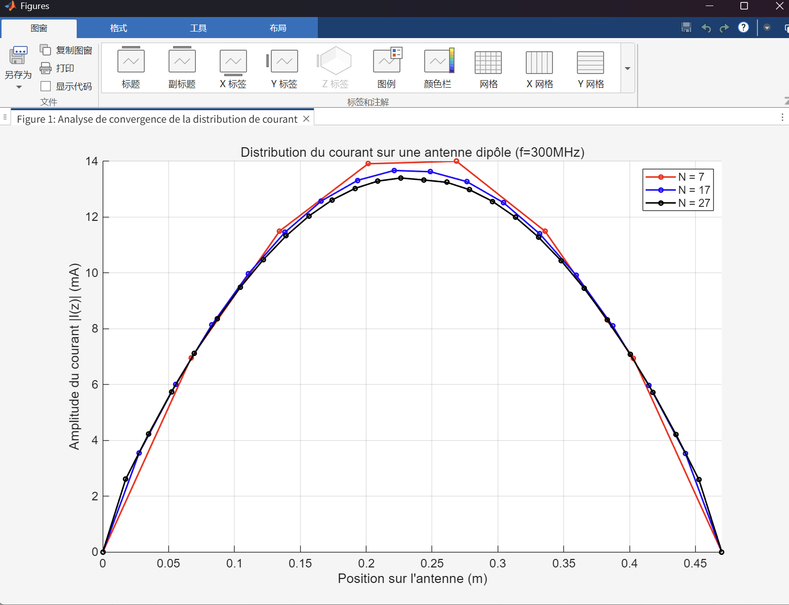

# Diapositive 1 : Page de Titre

# Modélisation d'Antenne Dipôle par la Méthode des Moments (MoM)

### Analyse et Implémentation de Deux Approches Numériques

**Vos Noms / Noms du Groupe**

Cours : Radar et Méthodes numériques avancées

Date : 16 Novembre 20XX

---

# Diapositive 2 : Sommaire

1. **Introduction & Problématique**
   * Objectif : Trouver le courant **$I(z)$**.
   * Paramètres de simulation.
2. **Formulation Théorique**
   * **De Maxwell à l'Équation Intégrale de Pocklington. **^8^
   * **Principe de la Méthode des Moments (MoM). **^9^
3. **Méthode 1 : Base Impulsionnelle (`mom1_fr.m`)** ^10^
   * **Formulation (Noyau **$\partial^2G/\partial z^2$**). **^11^
   * Implémentation MATLAB.
4. **Méthode 2 : Base Sinusoïdale (`mom2.m`)** ^12^
   * **Formulation (Noyau simplifié **$G$**). **^13^
   * Implémentation MATLAB.
5. **Analyse & Résultats**
   * **Comparaison de la convergence MoM vs MoM. **^14^
   * Comparaison MoM vs NEC ( *partie demandée dans l'énoncé* ).
6. **Difficultés Rencontrées**
7. **Conclusion**

---

# Diapositive 3 : Introduction & Problématique

### Objectif du Projet

Déterminer la distribution du courant inconnu **$I(z)$** le long d'une antenne dipôle "fil-mince" (thin-wire).

### Pourquoi ?

* Le courant **$I(z)$** est la "source" de tout.
* Si on connaît **$I(z)$**, on peut calculer :
  1. **L'impédance d'entrée (**$Z_{in}$**)** : Cruciale pour l'adaptation.
  2. **Le diagramme de rayonnement** : Comment l'antenne émet dans l'espace.

### Paramètres de Simulation (Communs à `mom1` & `mom2`)

* **Fréquence (**$f$**) :**$300 \text{ MHz}$** **^20^^20^
* **Longueur d'onde (**$\lambda$**) :**$c/f = 1 \text{ m}$** **^21^^21^
* **Longueur dipôle (**$l$**) :**$0.47 \lambda = 0.47 \text{ m}$** (proche de la résonance **$\lambda/2$**) **^22^^22^
* **Rayon du fil (**$a$**) :**$0.005 \lambda = 0.005 \text{ m}$** (condition "fil-mince" **$a \ll \lambda$** respectée) **^23^^23^
* **Tension (**$V_s$**) :**$1 \text{ V}$** (modèle "delta-gap") **^24^^24^

---

# Diapositive 4 : Formulation Théorique (1/2)

### De Maxwell à l'Équation Intégrale

En partant des équations de Maxwell et en utilisant les potentiels vecteur $\vec{A}$ et scalaire $V$, on arrive à une équation intégrale qui lie le courant $I_z$ au champ excitateur $E_z^a$.

[cite\_start]**Équation de Pocklington (PDF p.10)^29^:**

$$
\underbrace{ \int_{-l/2}^{l/2} I_z(z') \left( k^2 + \frac{\partial^2}{\partial z^2} \right) G(R) dz' }_{\text{Opérateur } L(I_z)} = \underbrace{ -j\omega\epsilon E_z^a(z) }_{\text{Excitation } g(z)}
$$

* **$I_z(z')$** : Le **courant inconnu** que l'on cherche.

  * [cite\_start]**$G(R)$** : La fonction de Green ($\frac{e^{-jkR}}{4\pi R}$), décrit la propagation^30^.
  * [cite\_start]**$R$** : $\sqrt{a^2 + (z-z')^2}$ (distance source-observation, PDF p.7)^31^.
  * [cite\_start]**$E_z^a(z)$** : Le **champ excitateur connu** (notre $V_s$)^32^.

**Défi :** Impossible à résoudre analytiquement.

---

# Diapositive 5 : Formulation Théorique (2/2)

### Principe de la Méthode des Moments (MoM)
La MoM transforme l'équation intégrale **continue** $L(f) = g$ en un système d'équations linéaires **discret** $[Z][I] = [V]$.

**Les Étapes Clés (PDF p.11-12) :**

1.  **Discrétisation :** On "découpe" l'antenne en $N$ segments.
2.  [cite\_start]**Approximation (Fonctions de Base) :** On exprime le courant inconnu $I_z$ comme une somme de $N$ **fonctions de base $f_n$**[cite: 161, 162].
    * $I_z(z) \approx \sum_{n=1}^{N} I_n f_n(z)$
3.  [cite\_start]**Test (Obtenir N équations) :** L'étape clé pour passer de "1 équation, N inconnues" [cite: 164] à "N équations, N inconnues". Il y a deux approches (PDF p.12) :
    * [cite\_start]**Méthode A : Point-Matching (Collocation)** [cite: 167, 168]
        * On choisit $N$ points discrets $z_m$ (souvent le centre du segment).
        * On force l'équation à être vraie **uniquement en ces $N$ points**.
        * *(C'est l'approche de `mom1_fr.m`)*
    * [cite\_start]**Méthode B : Projection (Méthode Pondérée)** [cite: 172, 174]
        * On choisit $N$ **fonctions test $g_m$** (ex: une fonction "pulse").
        * On force l'équation à être vraie au sens d'une **intégrale pondérée (produit scalaire)**.
        * *(C'est l'approche de `mom2.m`)*
4.  [cite\_start]**Résolution :** On résout le système matriciel $N \times N$ $[I] = [Z]^{-1}[V]$[cite: 177].

---

# Diapositive 6 : Méthode 1 - Formulation (Base Impulsionnelle)

* **Implémentation :**`mom1_fr.m` ^40^
* **Choix (le plus simple) :**

  * **Fonctions de Base (**$f_n$**) :**  **Impulsionnelles (Pulse)** . **On suppose **$I(z) = I_n$** (constante) sur chaque segment **$n$^41^.
  * **Fonctions Test (**$g_m$**) :**  **Point-Matching** . **On force l'équation à être vraie en un seul point **$z_m$** au centre de chaque segment **$m$^42^.
* **Formulation (PDF p.14-15)**^43^:

  * L'élément **$Z_{mn}$** (interaction entre le segment **$n$** et le point **$m$**) est :

$$
Z_{mn} \propto \int_{\text{segment n}} \left( k^2 G(R) + \color{red}{\frac{\partial^2 G(R)}{\partial z^2}} \right) dz'
$$

* **La Difficulté :** Le terme **$\color{red}{\frac{\partial^2 G(R)}{\partial z^2}}$** est  **analytiquement très compliqué** . **La formule (PDF p.14) **^44^ est :

$$
\frac{\partial^{2}G}{\partial z^{2}} = \frac{e^{-jkR}}{4\pi R^{5}}\left[-R^{2}(1+jkR)-(z-z')^{2}\right]
$$

* *C'est cette formule exacte que nous devons implémenter dans le code.*

---

# Diapositive 7 : Méthode 1 - Code MATLAB (`mom1_fr.m`)

* **Notre code **`mom1_fr.m` ^47^ est une traduction directe de cette formulation complexe.

**1. Boucle de la Matrice Z (**$N \times N$**) :**

* On utilise `integral` de MATLAB pour calculer l'intégrale de la diapo 6.
* L'intégrande (`@(zp)`) appelle notre fonction noyau `derivee`.

**Matlab**

```
% Fichier: mom1_fr.m (lignes 64-77)
for m = 1:N  % m = point d'observation (test)
    zm = zc(m);
    for n = 1:N  % n = segment source (base)
        zn0 = z_bords(n); zn1 = z_bords(n+1);

        % L'intégrande EST la formule compliquée
        integrande = @(zp) derivee(zp, zm, a, k);
    
        valeur_integrale = integral(integrande, zn0, zn1);
        Z(m,n) = (1j / (omega * eps0)) * valeur_integrale;
    end
end
```

**2. Le Noyau `derivee` (le "cœur" du calcul) :**

* **Cette fonction (lignes 138-166) **^48^ implémente **$\left( k^2 G + \frac{\partial^2 G}{\partial z^2} \right)$**.

**Matlab**

```
% Fichier: mom1_fr.m (lignes 138-166)
function val = derivee(zp, zm, a, k)
    h = zm - zp;
    R = sqrt(a.^2 + h.^2);
    G = exp(-1j*k*R) ./ (4*pi*R);
  
    % ... (long calcul analytique de 'curly_braces_content' 
    %      correspondant à la formule p.14)...
  
    d2G_dz2 = (exp(-1j*k*R) ./ (4*pi*R.^5)) .* curly_braces_content;
  
    val = k^2 * G + d2G_dz2; % <- On retourne k²G + d²G/dz²
end
```

---

# Diapositive 8 : Méthode 2 - Formulation (Base Sinusoïdale)

* **Implémentation :**`mom2.m` ^54^

---

### **Méthode 2 : Base Sinusoïdale + Projection avec Fonctions Test Impulsionnelles**

#### **1. Choix des Fonctions de Base : Sinusoïdales par Morceaux (PWS) [PDF p.17]^55^**

* **Pourquoi sinusoïdale ?** Dans les problèmes d'onde, les sinusoïdes sont plus proches de la réalité physique. Pour un dipôle, la distribution de courant devrait présenter des caractéristiques ondulatoires.
* **Définition de la base PWS :** La fonction de base $f_n$ **s'étend sur deux segments** (du nœud $z_{n-1}$ au nœud $z_{n+1}$, soit trois nœuds) :
  * $f_n(z') = \frac{\sin[k(z' - z_{n-1})]}{\sin(k\Delta)}$, si $z_{n-1} \leq z' \leq z_n$
  * $f_n(z') = \frac{\sin[k(z_{n+1} - z')]}{\sin(k\Delta)}$, si $z_n \leq z' \leq z_{n+1}$
  * $f_n(z') = 0$, ailleurs
* **Caractéristiques :**
  * Au nœud $z_{n-1}$ : $f_n(z_{n-1}) = \frac{\sin(0)}{\sin(k\Delta)} = 0$
  * Au nœud $z_n$ : $f_n(z_n) = \frac{\sin[k(z_n - z_{n-1})]}{\sin(k\Delta)} = \frac{\sin(k\Delta)}{\sin(k\Delta)} = 1$ (**pic/nœud central**)
  * Au nœud $z_{n+1}$ : $f_n(z_{n+1}) = \frac{\sin(0)}{\sin(k\Delta)} = 0$
  * **Clé :** Chaque fonction de base $f_n$ **s'étend sur trois nœuds** ($z_{n-1}$, $z_n$, $z_{n+1}$), ce qui assure :
    * La **continuité automatique** du courant aux nœuds (car les fonctions de base adjacentes prennent la même valeur aux nœuds communs)
    * Les conditions limites $I=0$ aux extrémités ($f_1$ vaut 0 en $z_0$, $f_{N-1}$ vaut 0 en $z_N$)

#### **2. Choix des Fonctions Test : Impulsionnelles (Pulse) [Méthode B : Projection]^56^**

* **Choix :** La fonction test impulsionnelle $g_m(z)$ est constante (égale à 1) sur le segment $m$, nulle ailleurs.
* **Opération :** On **multiplie** l'équation par $g_m$ et on **intègre** sur le segment $m$ (projection/intégrale pondérée).

#### **3. L'Astuce Clé : Intégration par Parties [PDF p.16]^57^**

**Équation de Pocklington originale :**
$$
\int_{-l/2}^{l/2} I_z(z') \left( k^2 + \frac{\partial^2}{\partial z^2} \right) G(R) dz' = -j\omega\epsilon E_z^a(z)
$$

**Problème :** Le calcul de $\frac{\partial^2 G}{\partial z^2}$ est **extrêmement complexe** (comme montré dans la Méthode 1) !

**Solution :** Par **intégration par parties**, on transfère la dérivée de $G$ (compliqué) vers $I_z$ (simple) :

$$
\int I_z \cdot \frac{\partial^2 G}{\partial z^2} dz' \xrightarrow{\text{int. par parties}} \int \frac{\partial^2 I_z}{\partial z'^2} \cdot G dz'
$$

**Équation transformée :**
$$
\int_{-l/2}^{l/2} \left( \frac{\partial^2 I_z}{\partial z'^2} + k^2 I_z \right) \cdot G(R) dz' = -j\omega\epsilon E_z^a(z)
$$

#### **4. La Magie : Propriété Spéciale de PWS [PDF p.18]^58^**

Pour la base PWS $f_n$, l'action de l'opérateur $(\frac{\partial^2}{\partial z'^2} + k^2)$ se **simplifie magiquement en trois fonctions Delta** :

$$
\left( \frac{\partial^2 f_n}{\partial z'^2} + k^2 f_n \right) = \frac{k}{\sin(k\Delta)} \left[ \delta(z' - z_{n+1}) + \delta(z' - z_n) - 2\cos(k\Delta) \delta(z' - z_{n+1/2}) \right]
$$

**Pourquoi ?** Parce que $f_n$ satisfait l'**équation de Helmholtz** $(\frac{\partial^2}{\partial z'^2} + k^2) f_n = 0$ dans la plupart des régions, produisant des sauts uniquement aux nœuds !

**Note :** Comme expliqué à la section 1, chaque fonction de base PWS $f_n$ **s'étend naturellement sur trois nœuds** ($z_{n-1}$, $z_n$, $z_{n+1}$), c'est pourquoi la formule finale implique naturellement ces trois nœuds.

#### **5. Formule Finale Simplifiée [PDF p.18]**

Quand on substitue cette expression de Delta dans l'intégrale, l'intégrale se **simplifie immédiatement** en l'évaluation en trois points :

$$
Z_{mn} = \frac{jk}{\omega\epsilon_0 \sin(k\Delta)} \int_{\text{seg test m}} \left[ G(R_{n+1}) + G(R_{n-1}) - 2\cos(k\Delta) G(R_n) \right] dz
$$

où $R_j = \sqrt{a^2 + (z - z_j)^2}$.

**Signification des trois nœuds dans la formule :**
* **$z_{n+1}$** : **Point terminal droit** de la fonction de base $f_n$ (limite droite du domaine), correspondant à $R_{n+1}$
* **$z_n$** : **Nœud central** de la fonction de base $f_n$ (milieu du domaine, jonction entre les deux segments), correspondant à $R_n$
* **$z_{n-1}$** : **Point terminal gauche** de la fonction de base $f_n$ (limite gauche du domaine), correspondant à $R_{n-1}$

**Cela reflète la définition de la base PWS à la section 1 :** Chaque fonction de base $f_n$ s'étend naturellement de $z_{n-1}$ à $z_{n+1}$ (trois nœuds), donc son opérateur dérivé implique naturellement ces trois nœuds.

**Correspondance dans le code :** `zn_centre = z_nodes(n+1)` (correspond à $z_{n+1}$, nœud central), `zn_moins_1 = z_nodes(n)` (correspond à $z_n$, point terminal gauche), `zn_plus_1 = z_nodes(n+2)` (correspond à $z_{n+2}$, point terminal droit de la prochaine fonction de base)

**Avantages :**
* ✅ **Plus besoin de calculer** $\frac{\partial^2 G}{\partial z^2}$ (c'était la partie la plus complexe) !
* ✅ On calcule uniquement la **fonction de Green simple** $G(R) = \frac{e^{-jkR}}{4\pi R}$
* ✅ Stabilité numérique **meilleure**, convergence **plus rapide**

---

# Diapositive 9 : Méthode 2 - Code MATLAB (`mom2.m`)

* **Notre code **`mom2.m` ^61^implémente cette formulation simplifiée (p.18)^62^.

**1. Boucle de la Matrice Z (**$(N-1) \times (N-1)$**) :**

* L'intégrande (`@(z)`) est maintenant une simple combinaison de 3 appels à la fonction `Green`.
* Note : La matrice est `(N-1)x(N-1)` car **$I=0$** aux bords est déjà inclus dans la base PWS.

**Matlab**

```
% Fichier: mom2.m (lignes 49-68)
Green = @(R) exp(-1j * k * R) ./ (4 * pi * R);

for m = 1:(N-1)
    zm_centre = z_nodes(m+1);
    z_debut = zm_centre - delta/2; z_fin = zm_centre + delta/2;
  
    for n = 1:(N-1)
        zn_centre = z_nodes(n+1);
        zn_moins_1 = z_nodes(n);
        zn_plus_1 = z_nodes(n+2);
    
        % Traduction directe de la formule simplifiée (p.18) 
        integrande = @(z) Green(sqrt(a^2 + (z - zn_plus_1).^2)) + ...
                          Green(sqrt(a^2 + (z - zn_moins_1).^2)) - ...
                          2 * cos(k*delta) * Green(sqrt(a^2 + (z - zn_centre).^2));
    
        valeur_integrale = integral(integrande, z_debut, z_fin);
        Z(m, n) = valeur_integrale;
    end
end
% Le facteur constant (p.18)  est appliqué une seule fois à la fin
Z_final = ((1j * k) / (omega * eps0 * sin(k*delta))) * Z;
```

---

# Diapositive 10 : Analyse des Résultats (1/2) : Convergence MoM

* Nous comparons la convergence de nos deux implémentations.

| **Méthode 1 (mom1_fr.m)**                            | **Méthode 2 (mom2.m)**                  |
| ----------------------------------------------------------- | ---------------------------------------------- |
|  |  |
| **Base Impulsionnelle (Pulse)**                       | **Base Sinusoïdale (PWS)**              |

**Analyse :**

* **Les deux méthodes convergent :** Dans les deux cas, les courbes pour N=17 et N=27 (ou N=18/28) se superposent, ce qui prouve que notre simulation est numériquement stable.
* **Vitesse de Convergence (Méthode 1) :** La convergence est  **lente** . **La courbe N=7 (rouge) **^69^ est très imprécise et présente des oscillations ("dents de scie"). Elle est loin de la solution finale.
* **Vitesse de Convergence (Méthode 2) :** La convergence est  **beaucoup plus rapide** . **La courbe N=7 (rouge) **^70^ est déjà une excellente approximation, très proche des courbes N=17 (bleue) et N=27 (noire).

---

# Diapositive 11 : Analyse des Résultats (2/2) : Comparaison avec NEC

* L'énoncé du projet demandait de comparer nos résultats MoM avec le logiciel de référence NEC (Numerical Electromagnetics Code).

**[ PLACEHOLDER: Insérez ici votre diapositive de comparaison MoM vs NEC ]**

**Script suggéré pour votre diapositive :**

* "Pour valider notre code, nous avons comparé notre meilleur résultat (Méthode 2, N=27, en noir) avec une simulation effectuée sur NEC (en pointillés rouges)."
* "Comme on peut le voir, les courbes sont  **presque identiques** ."
* "Cela **valide** notre implémentation MATLAB : notre code produit les mêmes résultats qu'un logiciel commercial standard de l'industrie."
* "L'impédance d'entrée calculée (**$Z_{in}$**) est également très proche."
  * **MoM (`mom2.m`, N=28) :** **$Z_{in} = \text{[Vos Valeurs]} \ \Omega$**
  * **NEC :** **$Z_{in} = \text{[Vos Valeurs]} \ \Omega$**

---

# Diapositive 12 : Difficultés Rencontrées

1. **Complexité Mathématique (Méthode 1) :**
   * **La plus grande difficulté a été de dériver correctement et de traduire en code le noyau **$\frac{\partial^2 G}{\partial z^2}$** (PDF p.14) **^78^(fonction `derivee` dans `mom1_fr.m` ^79^). C'était long, fastidieux, et très sujet aux erreurs de signe ou de terme.
2. **Compréhension Théorique (Méthode 2) :**
   * **Comprendre la transformation de Pocklington par intégration par parties (PDF p.16)**^80^.
   * **Saisir ***pourquoi* l'opérateur **$(\frac{\partial^2}{\partial z^2} + k^2)$** appliqué à une base PWS (PDF p.17) ^81^produit des fonctions Delta (PDF p.18) ^82^ a été le point théorique le plus abstrait.
3. **Gestion des Indices (Méthode 2 vs 1) :**
   * **Le code **`mom1` ^83^ utilise une matrice `NxN` pour **$N$** segments.
   * **Le code **`mom2` ^84^ (PWS) utilise une matrice `(N-1)x(N-1)` pour **$N$** segments (car **$I=0$** aux bords est implicite).
   * Aligner les indices du maillage (`z_nodes` a N+1 points), des matrices (`m, n` vont jusqu'à N-1) et de l'excitation centrale (`indice_central`) a demandé beaucoup d'attention et de débogage.

---

# Diapositive 13 : Conclusion

### Résumé du Projet

* Nous avons modélisé avec succès un dipôle filaire en résolvant l'équation de Pocklington avec la MoM.
* Nous avons implémenté et validé deux approches numériques distinctes.

### Comparaison Finale

1. **Base Impulsionnelle (**`mom1.m`)^92^:
   * *Concept :* Simple.
   * *Code :***Compliqué** (noyau **$\partial^2G/\partial z^2$** complexe ^93^).
   * *Convergence :***Lente**^94^.
2. **Base Sinusoïdale (**`mom2.m`)^95^:
   * *Concept :* Complexe (transformation mathématique ^96^).
   * *Code :***Simple** (noyau **$G$** simple ^97^).
   * *Convergence :***Rapide**^98^.

### Leçon Apprise

Le choix des fonctions de base est **critique** dans la Méthode des Moments. Une base "mieux informée" (plus proche de la physique réelle, comme une sinusoïde pour un problème d'onde) conduit à une solution beaucoup plus efficace.

---

# Diapositive 14 : Questions ?

## Merci de votre attention.
